# AUTOMATE INFRASTRUCTURE WITH IAC USING TERRAFORM. PART 3 – REFACTORING

## Table of Contents
- [Introduction](#introduction)
- [prerequisites](#prerequisites)
- [Introducing Backend on S3](#introducing-backend-on-s3)
- [Refactoring](#refactoring)


## Introduction
From our previous project, we have developed a Terraform project that can implement an AWS infrastructure code using Terraform. In this project, we will work on refactoring the code.

## Prerequisites
- [Terraform](https://www.terraform.io/downloads.html)
- [AWS Account](https://aws.amazon.com/premiumsupport/knowledge-center/create-and-activate-aws-account/)
- [AWS CLI](https://docs.aws.amazon.com/cli/latest/userguide/install-cliv2.html)
- [AWS IAM User](https://docs.aws.amazon.com/IAM/latest/UserGuide/id_users_create.html)
- [AWS IAM User Access Key](https://docs.aws.amazon.com/IAM/latest/UserGuide/id_credentials_access-keys.html)
- [AWS S3 Bucket](https://s3.console.aws.amazon.com/s3/)
- Code Editor (VS Code, Atom, Sublime Text, etc.)
- [Past Project Files](https://github.com/manny-uncharted/project-17)


## Introducing Backend on S3
In the previous project, we have used the local backend to store the state file. This is not a good practice as it is not recommended to store the state file locally. In this project, we will be using the S3 backend to store the state file. This will allow us to share the state file with other team members and also allow us to collaborate on the project.

- Create a file and name it `backend.tf` and add the following code:
```terraform
resource "aws_s3_bucket" "terraform_state" {
  bucket = "<your-name>-dev-terraform-bucket"
  # Enable versioning so we can see the full revision history of our state files
  versioning {
    enabled = true
  }
  # Enable server-side encryption by default
  server_side_encryption_configuration {
    rule {
      apply_server_side_encryption_by_default {
        sse_algorithm = "AES256"
      }
    }
  }
}
```
Note: Terraform stores secret data inside state files. Passwords and secret keys processed by resources are always stored in there. There we need to always enable encryption. This is achieved with the [server_side_encryption_configuration](https://docs.aws.amazon.com/AmazonS3/latest/userguide/serv-side-encryption.html)

result:
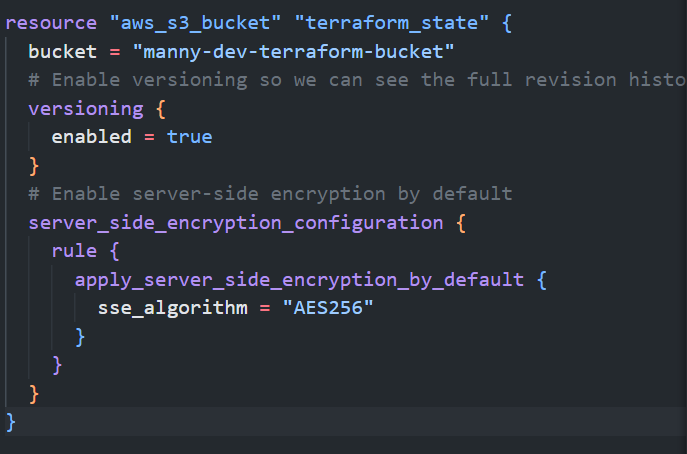

- Create a DynamoDB table to handle locks and perform consistency checks. In our previous projects, locks were handled with a local file shown in `terraform.tfstate.lock.info`. Since we want to enable collaboration, which made us to configure S3 as our backend to store our state file, we need to do the same to handle locking. Therefore, with a cloud database like DynamoDB, anyone running Terraform against the same infrastructure can use a central location to control a situation where Terraform is running at the same time from multiple individuals on our DevOps Team.
Add the following code to our `backend.tf` file for DynamoDB resource for locking and consistency checking:
```terraform
resource "aws_dynamodb_table" "terraform_locks" {
  name         = "terraform-locks"
  billing_mode = "PAY_PER_REQUEST"
  hash_key     = "LockID"
  attribute {
    name = "LockID"
    type = "S"
  }

  tags = merge(
    var.tags,
    {
      Name = format("%s-DynamoDB-Terraform-State-Lock-Table-%s", var.name, var.environment)
    },
  )
}
```

result:
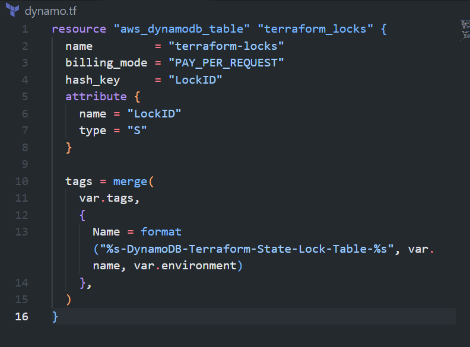

- Now let's run `terraform init` and `terraform apply` to create the S3 bucket and DynamoDB table. This will be used to store the state file and handle locking and consistency checks. As Terraform expects us to have the S3 bucket and DynamoDB created before we can use them as our backend, we need to run `terraform apply` to create them. After running `terraform apply`, we will get the following output:
```bash
terraform init
terraform apply --auto-approve
```

result:


- Now let's configure our backend to use the S3 bucket and DynamoDB table we just created. Add the following code to our `backend.tf` file:
```terraform
terraform {
  backend "s3" {
    bucket         = "manny-dev-terraform-bucket"
    key            = "global/s3/terraform.tfstate"
    region         = "us-east-1"
    dynamodb_table = "terraform-locks"
    encrypt        = true
  }
}
```

result:
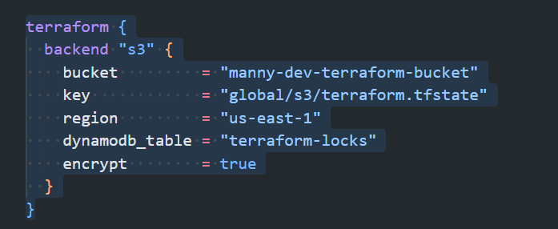

- Now it's time to run `terraform init` again to initialize the backend. After running `terraform init`, we will get the following output:
```bash
terraform init
```

result:
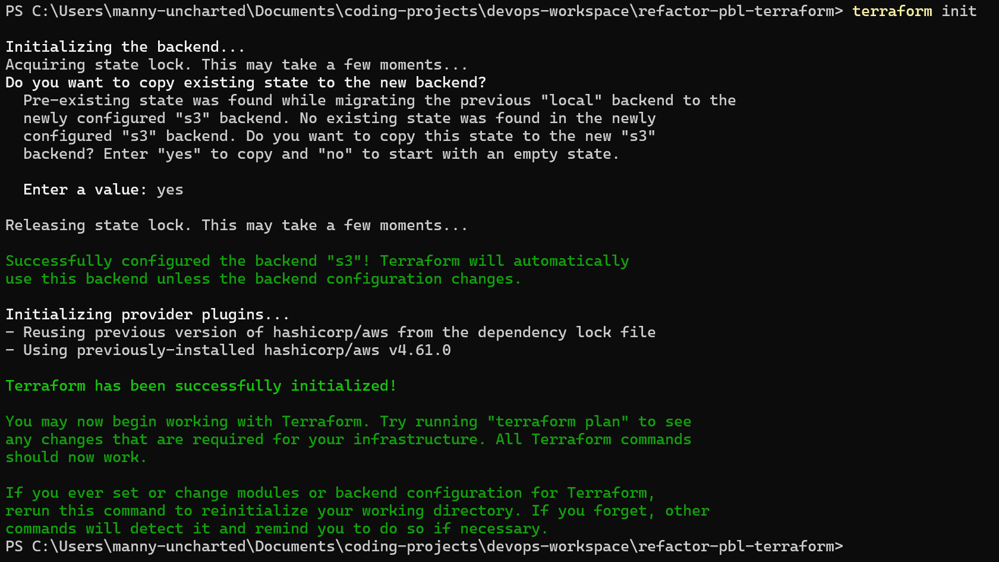

- Now let's verify the changes. Open your AWS console and navigate to S3. You will see the S3 bucket we created earlier. Click on the bucket and you will see the state file we created earlier. This is the state file we will be using to manage our infrastructure. This is the state file we will be sharing with our team members and collaborators.

result:
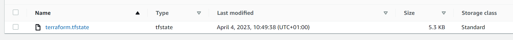

- Let's also check on our Dynamo DB table. Navigate to the DynamoDB table inside AWS and leave the page open in your browser. Run terraform plan and while that is running, refresh the browser and see how the lock is being handled:

result:
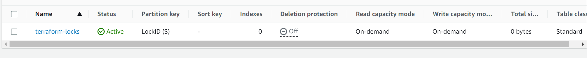

- Now let's re-initialize the backend. Run `terraform init` again to initialize the backend. After running `terraform init`, we will get the following output:
```bash
terraform init
```

result:


- Let's verify the changes that happened after re-initializing our backend. We would open our S3 bucket and also our DynamoDB table
    - Open your AWS console and navigate to S3. You will see the S3 bucket we created earlier. Click on the bucket and you will see the state file we created earlier. This is the state file we will be using to manage our infrastructure. This is the state file we will be sharing with our team members and collaborators.

    result:
    

    - Let's also check on our Dynamo DB table. Navigate to the DynamoDB table inside AWS and leave the page open in your browser. Run terraform plan and while that is running, refresh the browser and see how the lock is being handled:

    result:
    


Before we apply our current changes let's add an output such that the S3 bucket `Amazon Resource Name (ARN)` is displayed after running `terraform apply`. This will allow us to use the S3 bucket ARN in other projects.

- Now let's create a new file and name it `output.tf` and add the following code:
output "s3_bucket_arn" {
  value       = aws_s3_bucket.terraform_state.arn
  description = "The ARN of the S3 bucket"
}
output "dynamodb_table_name" {
  value       = aws_dynamodb_table.terraform_locks.name
  description = "The name of the DynamoDB table"
}

result:
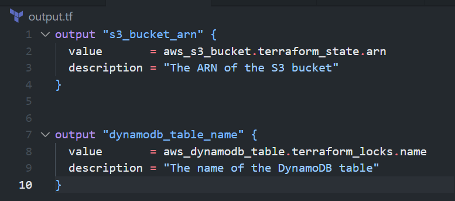

- Now that we have everything ready to go. Let's run `terraform apply` to apply our changes. After running `terraform apply`, we will get the following output:
```bash
terraform apply --auto-approve
```

result:
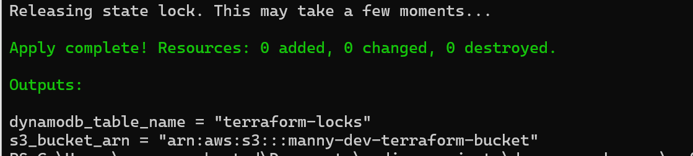

With help of the remote backend and locking configuration that we have just configured, collaboration is no longer a problem.


## Refactoring
In our previous project, we created the resources for our architecture in a single directory, with this approach things can get messy pretty fast and when we need to modify our code and add or delete resources it makes it difficult to find. In this section, we will refactor our code, by separating them into terraform modules to make it more organized and easier to manage.

- Let's create a new directory and name it `modules`. This will be the directory where we will store our Terraform modules.
```bash
mkdir modules
```

- In our modules directory, let's create the following directories:
```bash
cd modules
mkdir ALB Autoscaling EFS RDS compute VPC Security
```

result:
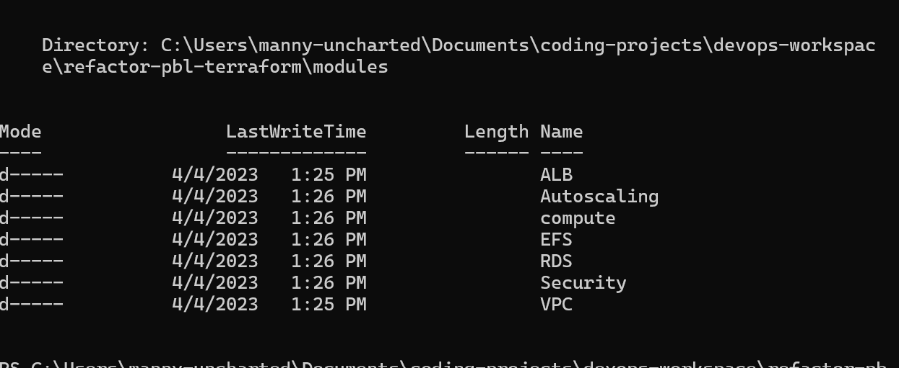

- Let's move all the files that have to do with networking to the VPC directory.

result:
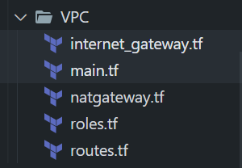

- Let's also move the `rds.tf` file to the RDS directory.

result:
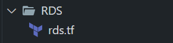

- Let's move the `alb.tf`, `cert.tf` and `outputs.tf` files to the ALB directory.

result:
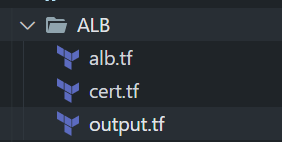

- Let's move the `efs.tf` file to the EFS directory.

result:
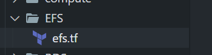

- Let's move the `asg-*.tf`, `*sh`,  files to the Autoscaling directory.

result:
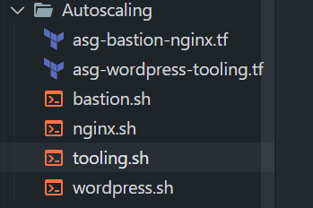

- Let's move the `security.tf` file to the Security directory.

result:
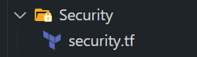

- Now in let's create the following files in the root directory:
    - `main.tf`
    - `variables.tf`
    - `outputs.tf`
    - `providers.tf`

result:
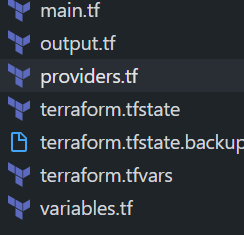