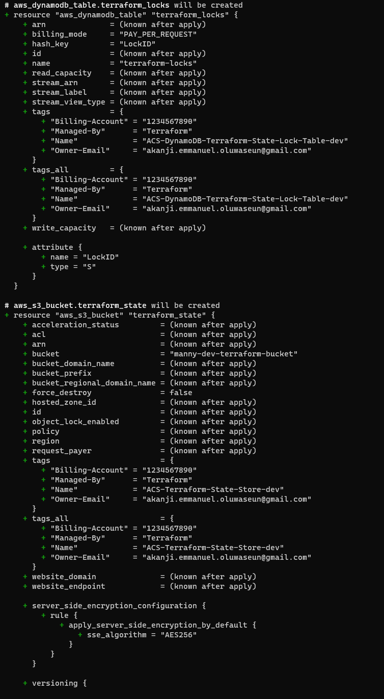

# AUTOMATE INFRASTRUCTURE WITH IAC USING TERRAFORM. PART 3 – REFACTORING

## Table of Contents
- [Introduction](#introduction)
- [prerequisites](#prerequisites)
- [Introducing Backend on S3](#introducing-backend-on-s3)
- [Refactoring](#refactoring)
    - [ALB module](#alb-module)
    - [VPC module](#vpc-module)
    - [RDS module](#rds-module)
    - [Autoscaling Group module](#autoscaling-group-module)
    - [Security Group module](#security-group-module)
    - [EFS module](#efs-module)
    -[Compute module](#compute-module)
    - [Defining Modules in Root Main.tf](#defining-modules-in-root-maintf)
- [Conclusion](#conclusion)


## Introduction
From our previous project, we have developed a Terraform project that can implement an AWS infrastructure code using Terraform. In this project, we will work on refactoring the code.

## Prerequisites
- [Terraform](https://www.terraform.io/downloads.html)
- [AWS Account](https://aws.amazon.com/premiumsupport/knowledge-center/create-and-activate-aws-account/)
- [AWS CLI](https://docs.aws.amazon.com/cli/latest/userguide/install-cliv2.html)
- [AWS IAM User](https://docs.aws.amazon.com/IAM/latest/UserGuide/id_users_create.html)
- [AWS IAM User Access Key](https://docs.aws.amazon.com/IAM/latest/UserGuide/id_credentials_access-keys.html)
- [AWS S3 Bucket](https://s3.console.aws.amazon.com/s3/)
- Code Editor (VS Code, Atom, Sublime Text, etc.)
- [Past Project Files](https://github.com/manny-uncharted/project-17)


## Introducing Backend on S3
In the previous project, we have used the local backend to store the state file. This is not a good practice as it is not recommended to store the state file locally. In this project, we will be using the S3 backend to store the state file. This will allow us to share the state file with other team members and also allow us to collaborate on the project.

- Create a file and name it `backend.tf` and add the following code:
```terraform
resource "aws_s3_bucket" "terraform_state" {
  bucket = "<your-name>-dev-terraform-bucket"
  # Enable versioning so we can see the full revision history of our state files
  versioning {
    enabled = true
  }
  # Enable server-side encryption by default
  server_side_encryption_configuration {
    rule {
      apply_server_side_encryption_by_default {
        sse_algorithm = "AES256"
      }
    }
  }
}
```
Note: Terraform stores secret data inside state files. Passwords and secret keys processed by resources are always stored in there. There we need to always enable encryption. This is achieved with the [server_side_encryption_configuration](https://docs.aws.amazon.com/AmazonS3/latest/userguide/serv-side-encryption.html)

result:


- Create a DynamoDB table to handle locks and perform consistency checks. In our previous projects, locks were handled with a local file shown in `terraform.tfstate.lock.info`. Since we want to enable collaboration, which made us to configure S3 as our backend to store our state file, we need to do the same to handle locking. Therefore, with a cloud database like DynamoDB, anyone running Terraform against the same infrastructure can use a central location to control a situation where Terraform is running at the same time from multiple individuals on our DevOps Team.
Add the following code to our `backend.tf` file for DynamoDB resource for locking and consistency checking:
```terraform
resource "aws_dynamodb_table" "terraform_locks" {
  name         = "terraform-locks"
  billing_mode = "PAY_PER_REQUEST"
  hash_key     = "LockID"
  attribute {
    name = "LockID"
    type = "S"
  }

  tags = merge(
    var.tags,
    {
      Name = format("%s-DynamoDB-Terraform-State-Lock-Table-%s", var.name, var.environment)
    },
  )
}
```

result:


- Now let's run `terraform init` and `terraform apply` to create the S3 bucket and DynamoDB table. This will be used to store the state file and handle locking and consistency checks. As Terraform expects us to have the S3 bucket and DynamoDB created before we can use them as our backend, we need to run `terraform apply` to create them. After running `terraform apply`, we will get the following output:
```bash
terraform init
terraform apply --auto-approve
```

result:



- Now let's configure our backend to use the S3 bucket and DynamoDB table we just created. Add the following code to our `backend.tf` file:
```terraform
terraform {
  backend "s3" {
    bucket         = "manny-dev-terraform-bucket"
    key            = "global/s3/terraform.tfstate"
    region         = "us-east-1"
    dynamodb_table = "terraform-locks"
    encrypt        = true
  }
}
```

result:


- Now it's time to run `terraform init` again to initialize the backend. After running `terraform init`, we will get the following output:
```bash
terraform init
```

result:


- Now let's verify the changes. Open your AWS console and navigate to S3. You will see the S3 bucket we created earlier. Click on the bucket and you will see the state file we created earlier. This is the state file we will be using to manage our infrastructure. This is the state file we will be sharing with our team members and collaborators.

result:


- Let's also check on our Dynamo DB table. Navigate to the DynamoDB table inside AWS and leave the page open in your browser. Run terraform plan and while that is running, refresh the browser and see how the lock is being handled:

result:


- Now let's re-initialize the backend. Run `terraform init` again to initialize the backend. After running `terraform init`, we will get the following output:
```bash
terraform init
```

result:


- Let's verify the changes that happened after re-initializing our backend. We would open our S3 bucket and also our DynamoDB table
    - Open your AWS console and navigate to S3. You will see the S3 bucket we created earlier. Click on the bucket and you will see the state file we created earlier. This is the state file we will be using to manage our infrastructure. This is the state file we will be sharing with our team members and collaborators.

    result:

    

    - Let's also check on our Dynamo DB table. Navigate to the DynamoDB table inside AWS and leave the page open in your browser. Run terraform plan and while that is running, refresh the browser and see how the lock is being handled:

    result:

    


Before we apply our current changes let's add an output such that the S3 bucket `Amazon Resource Name (ARN)` is displayed after running `terraform apply`. This will allow us to use the S3 bucket ARN in other projects.

- Now let's create a new file and name it `output.tf` and add the following code:
output "s3_bucket_arn" {
  value       = aws_s3_bucket.terraform_state.arn
  description = "The ARN of the S3 bucket"
}
output "dynamodb_table_name" {
  value       = aws_dynamodb_table.terraform_locks.name
  description = "The name of the DynamoDB table"
}

result:


- Now that we have everything ready to go. Let's run `terraform apply` to apply our changes. After running `terraform apply`, we will get the following output:
```bash
terraform apply --auto-approve
```

result:


With help of the remote backend and locking configuration that we have just configured, collaboration is no longer a problem.


## Refactoring
In our previous project, we created the resources for our architecture in a single directory, with this approach things can get messy pretty fast and when we need to modify our code and add or delete resources it makes it difficult to find. In this section, we will refactor our code, by separating them into terraform modules to make it more organized and easier to manage.

- Let's create a new directory and name it `modules`. This will be the directory where we will store our Terraform modules.
```bash
mkdir modules
```

- In our modules directory, let's create the following directories:
```bash
cd modules
mkdir ALB Autoscaling EFS RDS compute VPC Security
```

result:


- Let's move all the files that have to do with networking to the VPC directory.

result:


- Let's also move the `rds.tf` file to the RDS directory.

result:


- Let's move the `alb.tf`, `cert.tf` and `outputs.tf` files to the ALB directory.

result:


- Let's move the `efs.tf` file to the EFS directory.

result:


- Let's move the `asg-*.tf`, `*sh`,  files to the Autoscaling directory.

result:


- Let's move the `security.tf` file to the Security directory.

result:


- Now in let's create the following files in the root directory:
    - `main.tf`
    - `variables.tf`
    - `outputs.tf`
    - `providers.tf`

result:


- In our root directory `providers.tf` add the following lines of code:
```terraform
provider "aws" {
    region = var.region
}
```
Note: Ensure you remove this from the `main.tf` file present in our VPC directory.

result:


- In every module directory, we would need to create the following files:
    - `main.tf`
    - `variables.tf`
    - `outputs.tf`


### ALB module
- Now beginning with the `ALB module`, let's create the `main.tf` file and move the code in the `alb.tf` file to the `main.tf` file.

result:


- We would also need to declare variables for every hard-coded value in our `main.tf` file. Let's create the `variables.tf` file and add the following code:
```terraform
### ------ ALB/variables.tf ------ ###

# The security froup for external loadbalancer
variable "public-sg" {
  description = "Security group for external load balancer"
}

# The public subnet froup for external loadbalancer
variable "public-sbn-1" {
  description = "Public subnets to deploy external ALB"
}

variable "public-sbn-2" {
  description = "Public subnets to deploy external  ALB"
}

variable "vpc_id" {
  type        = string
  description = "The vpc ID"
}

variable "private-sg" {
  description = "Security group for Internal Load Balance"
}

variable "private-sbn-1" {
  description = "Private subnets to deploy Internal ALB"
}
variable "private-sbn-2" {
  description = "Private subnets to deploy Internal ALB"
}

variable "ip_address_type" {
  type        = string
  description = "IP address for the ALB"

}

variable "load_balancer_type" {
  type        = string
  description = "te type of Load Balancer"
}

variable "tags" {
  description = "A mapping of tags to assign to all resources."
  type        = map(string)
  default     = {}
}

variable "name" {
    type = string
    description = "name of the loadbalancer"
    default = "ext-alb"
  
}

variable "environment" {
  type        = string
  description = "The environment name"
  default = "dev"
}

variable "port" {
  type        = number
  description = "The port number"
  default = 443
}

variable "protocol" {
  type        = string
  description = "The protocol type"
  default = "HTTPS"
}

variable "company_name" {
  type        = string
  description = "The company name"
}

variable "interval" {
  type        = number
  description = "The interval for health check"
  default = 10
}

variable "path" {
  type        = string
  description = "The path for health check"
  default = "/healthstatus"
}

variable "timeout" {
  type        = number
  description = "The timeout for health check"
  default = 5
}

variable "healthy_threshold" {
  type        = number
  description = "The healthy threshold for health check"
  default = 5
}

variable "unhealthy_threshold" {
  type        = number
  description = "The unhealthy threshold for health check"
  default = 2
}

variable target_type {
  type        = string
  description = "The target type"
  default = "instance"
}

variable "default_action_type" {
  type        = string
  description = "The default action type"
  default = "forward"
}

variable "priority" {
  type        = number
  description = "The priority for the rule"
  default = 99
}
```

result:


- Let's now assign the variable we declared in the `variables.tf` file to the hard-coded values in the `main.tf` file. The `main.tf` file should look like this:
```terraform
### ----- ALB/main.tf ------ ###
# Create external application load balancer for reverse proxy nginx.
resource "aws_lb" "ext-alb" {
  name     = var.name
  internal = false
  security_groups = [
    var.public-sg
  ]

  subnets = [
    var.public-sbn-1,
    var.public-sbn-2
  ]

  tags = merge(
    var.tags,
    {
      Name = format("%s-ext-alb-%s", var.company_name, var.environment)
    },
  )

  ip_address_type    = var.ip_address_type
  load_balancer_type = var.load_balancer_type
}

# Create target group to point to its targets.
resource "aws_lb_target_group" "nginx-tg" {
  health_check {
    interval            = var.interval # 10
    path                = var.path # "/healthstatus"
    protocol            = var.protocol # "HTTPS"
    timeout             = var.timeout # 5
    healthy_threshold   = var.healthy_threshold # 5
    unhealthy_threshold = var.unhealthy_threshold # 2
  }
  name        = format("%s-nginx-tg-%s", var.company_name, var.environment)
  port        = var.port # 443
  protocol    = var.protocol # "HTTPS"
  target_type = var.target_type # "instance"
  vpc_id      = var.vpc_id
}

# Create listener to redirect traffic to the target group.
resource "aws_lb_listener" "nginx-listener" {
  load_balancer_arn = aws_lb.ext-alb.arn
  port              = var.port # 443
  protocol          = var.protocol # "HTTPS"
  certificate_arn   = aws_acm_certificate_validation.teskers.certificate_arn

  default_action {
    type             = var.default_action_type # "forward"
    target_group_arn = aws_lb_target_group.nginx-tg.arn
  }
}

#Internal Load Balancers for webservers
resource "aws_lb" "int-alb" {
  name     = "int-alb"
  internal = true
  security_groups = [
    var.private-sg
  ]

  subnets = [
    var.private-sbn-1,
    var.private-sbn-2
  ]

  tags = merge(
    var.tags,
    {
      Name = format("%s-int-alb-%s", var.company_name, var.environment)
    },
  )

  ip_address_type    = var.ip_address_type # "ipv4"
  load_balancer_type = var.load_balancer_type # "application"
}

# --- target group  for wordpress -------
resource "aws_lb_target_group" "wordpress-tg" {
  health_check {
    interval            = var.interval # 10
    path                = var.path # "/healthstatus"
    protocol            = var.protocol # "HTTPS"
    timeout             = var.timeout # 5
    healthy_threshold   = var.healthy_threshold # 5
    unhealthy_threshold = var.unhealthy_threshold # 2
  }

  name        = format("%s-wordpress-tg-%s", var.company_name, var.environment)
  port        = var.port # 443
  protocol    = var.protocol # "HTTPS"
  target_type = var.target_type # "instance"
  vpc_id      = var.vpc_id
}

# --- target group for tooling -------
resource "aws_lb_target_group" "tooling-tg" {
  health_check {
    interval            = var.interval # 10
    path                = var.path # "/healthstatus"
    protocol            = var.protocol # "HTTPS"
    timeout             = var. timeout # 5
    healthy_threshold   = var.healthy_threshold # 5
    unhealthy_threshold = var.unhealthy_threshold # 2
  }

  name        = format("%s-tooling-tg-%s", var.company_name, var.environment)
  port        = var.port # 443
  protocol    = var.protocol # "HTTPS"
  target_type = var.target_type # "instance"
  vpc_id      = var.vpc_id
}

# For this aspect a single listener was created for the wordpress which is default,
# A rule was created to route traffic to tooling when the host header changes
resource "aws_lb_listener" "web-listener" {
  load_balancer_arn = aws_lb.int-alb.arn
  port              = var.port # 443
  protocol          = var.protocol # "HTTPS"
  certificate_arn   = aws_acm_certificate_validation.teskers.certificate_arn

  default_action {
    type             = var.default_action_type # "forward"
    target_group_arn = aws_lb_target_group.wordpress-tg.arn
  }
}

# listener rule for tooling target
resource "aws_lb_listener_rule" "tooling-listener" {
  listener_arn = aws_lb_listener.web-listener.arn
  priority     = var.priority # 99

  action {
    type             = var.default_action_type # "forward"
    target_group_arn = aws_lb_target_group.tooling-tg.arn
  }

  condition {
    host_header {
      values = ["tooling.teskers.online"]
    }
  }
}
```

result:


- Let's now create the `outputs.tf` file. The `outputs.tf` file should look like this:
```terraform
### -------- ALB/output.tf -------- ###

output "alb_dns_name" {
  value = aws_lb.ext-alb.dns_name
}

output "alb_target_group_arn" {
  value = aws_lb_target_group.nginx-tg.arn
}

output "wordpress-tg" {
  description = "The target group for wordpress"
  value = aws_lb_target_group.wordpress-tg.arn
}

output "tooling-tg" {
  description = "The target group for tooling"
  value = aws_lb_target_group.tooling-tg.arn
}

output "nginx-tg" {
  description = "The target group for nginx"
  value = aws_lb_target_group.nginx-tg.arn
}
```

result:


### VPC Module

As we did in the ALB module, we'll create a VPC module. The VPC module will create the VPC, subnets, route tables, internet gateway, NAT gateway, and the security groups. The VPC module will be created in the `VPC` directory. The `VPC` directory will have the following files:

- In refactoring the `main.tf` file would look like this:
```terraform
### ------ VPC/main.tf ------ ###

resource "random_integer" "random" {
  min = 1
  max = 10
}

# Create VPC
resource "aws_vpc" "main" {
  cidr_block                     = var.vpc_cidr
  enable_dns_support             = var.enable_dns_support
  enable_dns_hostnames           = var.enable_dns_support
  enable_classiclink             = var.enable_classiclink
  enable_classiclink_dns_support = var.enable_classiclink

  tags = merge(
    var.tags,
    {
      Name = format("%s-VPC-%s", var.name, var.environment)
    },
  )
}

# Get list of availablility zones
data "aws_availability_zones" "available" {
  state = "available"
}

# Create public subnets1
resource "aws_subnet" "public" {
  count                   = var.preferred_number_of_public_subnets == null ? length(data.aws_availability_zones.available.names) : var.preferred_number_of_public_subnets
  vpc_id                  = aws_vpc.main.id
  cidr_block              = var.public_subnets[count.index] # cidrsubnet(var.vpc_cidr, 8, count.index)
  map_public_ip_on_launch = true
  availability_zone       = data.aws_availability_zones.available.names[count.index]

  tags = merge(
    var.tags,
    {
      Name = format("%s-Public-subnet-%s", var.name, count.index + 1)
    },
  )
}

# Create private subnet
resource "aws_subnet" "private" {
  count                   = var.preferred_number_of_private_subnets == null ? length(data.aws_availability_zones.available.names) : var.preferred_number_of_private_subnets
  vpc_id                  = aws_vpc.main.id
  cidr_block              = var.private_subnets[count.index] # cidrsubnet(var.vpc_cidr, 8, count.index + 2)
  map_public_ip_on_launch = true
  availability_zone       = data.aws_availability_zones.available.names[count.index]

  tags = merge(
    var.tags,
    {
      Name = format("%s-Private-subnet-%s", var.name, count.index + 1)
    },
  )
}
```

- The `variables.tf` file would look like this:
```terraform
### ------ VPC/variables.tf ------ ###
variable "region" {
  default = "us-east-1"
}

variable "vpc_cidr" {
  default = "172.16.0.0/16"
}

variable "enable_dns_support" {
  default = "true"
}

variable "enable_dns_hostnames" {
  default = "true"
}

variable "enable_classiclink" {
  default = "false"
}

variable "enable_classiclink_dns_support" {
  default = "false"
}

variable "preferred_number_of_public_subnets" {
  type        = number
  description = "Number of public subnets to create. If not specified, all available AZs will be used."
}

variable "preferred_number_of_private_subnets" {
  # default = 4
  type        = number
  description = "Number of private subnets to create. If not specified, all available AZs will be used."
}

variable "private_subnets" {
  type        = list(any)
  description = "List of private subnets"
}

variable "public_subnets" {
  type        = list(any)
  description = "list of public subnets"

}

variable "name" {
  description = "Name to be used on all the resources as identifier."
  type        = string
  default     = "ACS"
}

variable "tags" {
  description = "A mapping of tags to assign to all resources."
  type        = map(string)
  default     = {}
}

variable "environment" {
  description = "Environment where resources are being created."
  type        = string
  default     = "dev"
}

variable "destination_cidr_block" {
  description = "The CIDR block to allow access to the VPC."
  type        = string
  default     = "0.0.0.0/0"
}
```

- The `outputs.tf` file would look like this:
```terraform
output "public_subnets-1" {
  value       = aws_subnet.public[0].id
  description = "The first public subnet in the subnets"
}

output "public_subnets-2" {
  value       = aws_subnet.public[1].id
  description = "The first public subnet"
}


output "private_subnets-1" {
  value       = aws_subnet.private[0].id
  description = "The first private subnet"
}

output "private_subnets-2" {
  value       = aws_subnet.private[1].id
  description = "The second private subnet"
}


output "private_subnets-3" {
  value       = aws_subnet.private[2].id
  description = "The third private subnet"
}


output "private_subnets-4" {
  value       = aws_subnet.private[3].id
  description = "The fourth private subnet"
}


output "vpc_id" {
  value = aws_vpc.main.id
}


output "instance_profile" {
  value = aws_iam_instance_profile.ip.id
}
```

Note: The `outputs.tf` file is used to output the values of the resources created in the module. This is useful when we want to use the output of one module as input to another module.   


### RDS module
For our RDS module, we would create a new file called `main.tf` and add the following code:
```terraform
### ------- RDS/main.tf ------- ###

# create DB subnet group from the private subnets
resource "aws_db_subnet_group" "ACS-rds" {
  name       = "acs-rds"
  subnet_ids = var.private_subnets

  tags = merge(
    var.tags,
    {
      Name = "ACS-database"
    },
  )
}

# create the RDS instance with the subnets group
resource "aws_db_instance" "ACS-rds" {
  allocated_storage      = 20
  storage_type           = "gp2"
  engine                 = "mysql"
  engine_version         = "5.7"
  instance_class         = "db.t2.micro"
  name                   = "mannydb"
  username               = var.db-username
  password               = var.db-password
  parameter_group_name   = "default.mysql5.7"
  db_subnet_group_name   = aws_db_subnet_group.ACS-rds.name
  skip_final_snapshot    = true
  vpc_security_group_ids = var.db-sg
  multi_az               = "true"
}
```

- The `variables.tf` file would look like this:
```terraform
### ------- RDS/variables.tf ------- ###

variable "db-username" {
  type        = string
  description = "The master user name"
}


variable "db-password" {
  type        = string
  description = "Master password"
}

variable "db-sg" {
  type = list
  description = "The DB security group"
}

variable "private_subnets" {
  type        = list
  description = "Private subnets fro DB subnets group"
}


variable "tags" {
  description = "A mapping of tags to assign to all resources."
  type        = map(string)
  default     = {}
}
```


### Autoscaling Group module
For our autoscaling module, in our previous project we had it all in one file. This time we would separate our launch templates from the autoscaling files.

- The `asg-bastion-nginx.tf` file would look like this:
```terraform
# Get list of availability zones
data "aws_availability_zones" "available" {
  state = "available"
}


# creating sns topic for all the auto scaling groups
resource "aws_sns_topic" "ACS-sns" {
  name = "Default_CloudWatch_Alarms_Topic"
}


# creating notification for all the auto scaling groups
resource "aws_autoscaling_notification" "david_notifications" {
  group_names = [
    aws_autoscaling_group.bastion-asg.name,
    aws_autoscaling_group.nginx-asg.name,
    aws_autoscaling_group.wordpress-asg.name,
    aws_autoscaling_group.tooling-asg.name,
  ]
  notifications = [
    "autoscaling:EC2_INSTANCE_LAUNCH",
    "autoscaling:EC2_INSTANCE_TERMINATE",
    "autoscaling:EC2_INSTANCE_LAUNCH_ERROR",
    "autoscaling:EC2_INSTANCE_TERMINATE_ERROR",
  ]

  topic_arn = aws_sns_topic.ACS-sns.arn
}


resource "random_shuffle" "az_list" {
  input = data.aws_availability_zones.available.names
}


# ---- Autoscaling for bastion  hosts


resource "aws_autoscaling_group" "bastion-asg" {
  name                      = "bastion-asg"
  max_size                  = var.max_size
  min_size                  = var.min_size
  health_check_grace_period = 300
  health_check_type         = "ELB"
  desired_capacity          = var.desired_capacity

  vpc_zone_identifier = var.public_subnets
  


  launch_template {
    id      = aws_launch_template.bastion-launch-template.id
    version = "$Latest"
  }
  tag {
    key                 = "Name"
    value               = "ACS-bastion"
    propagate_at_launch = true
  }

}


# ------ Autoscslaling group for reverse proxy nginx ---------

resource "aws_autoscaling_group" "nginx-asg" {
  name                      = "nginx-asg"
  max_size                  = 2
  min_size                  = 1
  health_check_grace_period = 300
  health_check_type         = "ELB"
  desired_capacity          = 1
  
  vpc_zone_identifier = var.public_subnets


  launch_template {
    id      = aws_launch_template.nginx-launch-template.id
    version = "$Latest"
  }

  tag {
    key                 = "Name"
    value               = "ACS-nginx"
    propagate_at_launch = true
  }


}

# attaching autoscaling group of nginx to external load balancer
resource "aws_autoscaling_attachment" "asg_attachment_nginx" {
  autoscaling_group_name = aws_autoscaling_group.nginx-asg.id
  alb_target_group_arn   = var.nginx-alb-tg
}
```

- The `asg-wordpress-tooling.tf` file would look like this after refactoring:
```terraform

# ---- Autoscaling for wordpress application

resource "aws_autoscaling_group" "wordpress-asg" {
  name                      = "wordpress-asg"
  max_size                  = var.max_size
  min_size                  = var.min_size
  health_check_grace_period = 300
  health_check_type         = "ELB"
  desired_capacity          = var.desired_capacity
  vpc_zone_identifier = var.private_subnets


  launch_template {
    id      = aws_launch_template.wordpress-launch-template.id
    version = "$Latest"
  }
  tag {
    key                 = "Name"
    value               = "ACS-wordpress"
    propagate_at_launch = true
  }
}


# attaching autoscaling group of  wordpress application to internal loadbalancer
resource "aws_autoscaling_attachment" "asg_attachment_wordpress" {
  autoscaling_group_name = aws_autoscaling_group.wordpress-asg.id
  alb_target_group_arn   = var.wordpress-alb-tg
}


# ---- Autoscaling for tooling -----

resource "aws_autoscaling_group" "tooling-asg" {
  name                      = "tooling-asg"
  max_size                  = var.max_size
  min_size                  = var.min_size
  health_check_grace_period = 300
  health_check_type         = "ELB"
  desired_capacity          = var.desired_capacity
  vpc_zone_identifier = var.private_subnets

  launch_template {
    id      = aws_launch_template.tooling-launch-template.id
    version = "$Latest"
  }

  tag {
    key                 = "Name"
    value               = "ACS-tooling"
    propagate_at_launch = true
  }
}

# attaching autoscaling group of  tooling application to internal loadbalancer
resource "aws_autoscaling_attachment" "asg_attachment_tooling" {
  autoscaling_group_name = aws_autoscaling_group.tooling-asg.id
  alb_target_group_arn   = var.tooling-alb-tg
}
```

- Recall that we are separating the launch templates for the different applications into different files. 
    - The `lt-bastion-nginx.tf` file would look like this after refactoring:
        ```terraform
        # ---- Launch template for bastion host and nginx -----
        
        # launch template for bastion
        resource "aws_launch_template" "bastion-launch-template" {
        image_id               = var.ami-bastion
        instance_type          = "t2.micro"
        vpc_security_group_ids = var.bastion-sg

        iam_instance_profile {
            name = var.instance_profile
        }

        key_name = var.keypair

        placement {
            availability_zone = "random_shuffle.az_list.result"
        }

        lifecycle {
            create_before_destroy = true
        }

        tag_specifications {
            resource_type = "instance"


        tags = merge(
            var.tags,
            {
            Name = "bastion-launch-template"
            },
        )
            
        }

        user_data = filebase64("${path.module}/bastion.sh")
        }


        # launch template for nginx

        resource "aws_launch_template" "nginx-launch-template" {
        image_id               = var.ami-nginx
        instance_type          = "t2.micro"
        vpc_security_group_ids = var.nginx-sg

        iam_instance_profile {
            name = var.instance_profile
        }

        key_name = var.keypair

        placement {
            availability_zone = "random_shuffle.az_list.result"
        }

        lifecycle {
            create_before_destroy = true
        }

        tag_specifications {
            resource_type = "instance"

        tags = merge(
            var.tags,
            {
            Name = "nginx-launch-template"
            },
        )
        }

        user_data = filebase64("${path.module}/nginx.sh")
        }
        ```
        Note: The code above creates the launch templates for the nginx and bastion host.

    - The `lt-wordpress-tooling.tf` file would look like this after refactoring:
        ```terraform
        # ---- Launch template for wordpress and tooling -----

        # launch template for wordpress
        resource "aws_launch_template" "wordpress-launch-template" {
        image_id               = var.ami-web
        instance_type          = "t2.micro"
        vpc_security_group_ids = var.web-sg

        iam_instance_profile {
            name = var.instance_profile
        }

        key_name = var.keypair


        placement {
            availability_zone = "random_shuffle.az_list.result"
        }

        lifecycle {
            create_before_destroy = true
        }

        tag_specifications {
            resource_type = "instance"

        tags = merge(
            var.tags,
            {
            Name = "wordpress-launch-template"
            },
        )
        }

        user_data = filebase64("${path.module}/wordpress.sh")
        }


        # launch template for toooling
        resource "aws_launch_template" "tooling-launch-template" {
        image_id               = var.ami-web
        instance_type          = "t2.micro"
        vpc_security_group_ids = var.web-sg

        iam_instance_profile {
            name = var.instance_profile
        }

        key_name = var.keypair


        placement {
            availability_zone = "random_shuffle.az_list.result"
        }

        lifecycle {
            create_before_destroy = true
        }

        tag_specifications {
            resource_type = "instance"


        tags = merge(
            var.tags,
            {
            Name = "tooling-launch-template"
            },
        )
        }

        user_data = filebase64("${path.module}/tooling.sh")
        }
        ```
        Note: The code above creates the launch templates for the WordPress and tooling applications.

- The `variables.tf` file would look like this after refactoring:
```terraform
### ------- Autoscaling/variables.tf ------- ###

variable "ami-web" {
  type        = string
  description = "ami for webservers"
}

variable "instance_profile" {
  type        = string
  description = "Instance profile for launch template"
}


variable "keypair" {
  type        = string
  description = "Keypair for instances"
}

variable "ami-bastion" {
  type        = string
  description = "ami for bastion"
}

variable "web-sg" {
  type = list
  description = "security group for webservers"
}

variable "bastion-sg" {
  type = list
  description = "security group for bastion"
}

variable "nginx-sg" {
  type = list
  description = "security group for nginx"
}

variable "private_subnets" {
  type = list
  description = "first private subnets for internal ALB"
}


variable "public_subnets" {
  type = list
  description = "Seconf subnet for ecternal ALB"
}


variable "ami-nginx" {
  type        = string
  description = "ami for nginx"
}

variable "nginx-alb-tg" {
  type        = string
  description = "nginx reverse proxy target group"
}

variable "wordpress-alb-tg" {
  type        = string
  description = "wordpress target group"
}


variable "tooling-alb-tg" {
  type        = string
  description = "tooling target group"
}


variable "max_size" {
  type        = number
  description = "maximum number for autoscaling"
}

variable "min_size" {
  type        = number
  description = "minimum number for autoscaling"
}

variable "desired_capacity" {
  type        = number
  description = "Desired number of instance in autoscaling group"

}

variable "tags" {
  description = "A mapping of tags to assign to all resources."
  type        = map(string)
  default     = {}
}
```
The above section of code contains the variables we defined for our autoscaling groups which would also have to be referenced in the root module.


### Security Group module
As was done in the VPC module, the security group module is created in the `Security` directory. 

- The `main.tf` file would look like this:
```terraform
### ------ Security/main.tf ------ ###
# create all security groups dynamically
resource "aws_security_group" "ACS" {
  for_each    = local.security_groups
  name        = each.value.name
  description = each.value.description
  vpc_id      = var.vpc_id

 
  egress {
    from_port   = 0
    to_port     = 0
    protocol    = "-1"
    cidr_blocks = ["0.0.0.0/0"]
  }

  tags = merge(
    var.tags,
    {
      Name = each.value.name
    },
  )
}
```

Note: Here we are dynamically creating security groups using the `for_each` attribute. The `for_each` attribute is used to create multiple resources of the same type. The `for_each` attribute takes a map or a set as input. In this case, we are using a map as input. The map is defined in the `security.tf` file. The `security.tf` file would look like this:
```terraform
# creating dynamic ingress security groups
locals {
  security_groups = {
    ext-alb-sg = {
      name        = "ext-alb-sg"
      description = "for external application load balancer"

    }

    # security group for bastion
    bastion-sg = {
      name        = "bastion-sg"
      description = "for bastion instances"
    }

    # security group for nginx
    nginx-sg = {
      name        = "nginx-sg"
      description = "nginx instances"
    }

    # security group for IALB
    int-alb-sg = {
      name        = "int-alb-sg"
      description = "Internal ALB security group"
    }


    # security group for webservers
    webserver-sg = {
      name        = "webserver-sg"
      description = "webservers security group"
    }


    # security group for data-layer
    datalayer-sg = {
      name        = "datalayer-sg"
      description = "data layer security group"


    }
  }
}
```

- The rules for the security groups are defined in the `sg-rules.tf` file. The `sg-rules.tf` file would look like this:
```terraform
resource "aws_security_group_rule" "inbound-nginx-http" {
  type                     = "ingress"
  from_port                = 443
  to_port                  = 443
  protocol                 = "tcp"
  source_security_group_id = aws_security_group.ACS["ext-alb-sg"].id
  security_group_id        = aws_security_group.ACS["nginx-sg"].id
}

resource "aws_security_group_rule" "inbound-bastion-ssh" {
  type                     = "ingress"
  from_port                = 22
  to_port                  = 22
  protocol                 = "tcp"
  source_security_group_id = aws_security_group.ACS["bastion-sg"].id
  security_group_id        = aws_security_group.ACS["nginx-sg"].id
}


resource "aws_security_group_rule" "inbound-int-alb-https" {
  type                     = "ingress"
  from_port                = 443
  to_port                  = 443
  protocol                 = "tcp"
  source_security_group_id = aws_security_group.ACS["nginx-sg"].id
  security_group_id        = aws_security_group.ACS["int-alb-sg"].id
}


resource "aws_security_group_rule" "inbound-web-https" {
  type                     = "ingress"
  from_port                = 443
  to_port                  = 443
  protocol                 = "tcp"
  source_security_group_id = aws_security_group.ACS["int-alb-sg"].id
  security_group_id        = aws_security_group.ACS["webserver-sg"].id
}

resource "aws_security_group_rule" "inbound-web-ssh" {
  type                     = "ingress"
  from_port                = 22
  to_port                  = 22
  protocol                 = "tcp"
  source_security_group_id = aws_security_group.ACS["bastion-sg"].id
  security_group_id        = aws_security_group.ACS["webserver-sg"].id
}

resource "aws_security_group_rule" "inbound-nfs-port" {
  type                     = "ingress"
  from_port                = 2049
  to_port                  = 2049
  protocol                 = "tcp"
  source_security_group_id = aws_security_group.ACS["webserver-sg"].id
  security_group_id        = aws_security_group.ACS["datalayer-sg"].id
}

resource "aws_security_group_rule" "inbound-mysql-bastion" {
  type                     = "ingress"
  from_port                = 3306
  to_port                  = 3306
  protocol                 = "tcp"
  source_security_group_id = aws_security_group.ACS["bastion-sg"].id
  security_group_id        = aws_security_group.ACS["datalayer-sg"].id
}

resource "aws_security_group_rule" "inbound-mysql-webserver" {
  type                     = "ingress"
  from_port                = 3306
  to_port                  = 3306
  protocol                 = "tcp"
  source_security_group_id = aws_security_group.ACS["webserver-sg"].id
  security_group_id        = aws_security_group.ACS["datalayer-sg"].id
}
```

- The `outputs.tf` file would look like this:
```terraform
output "Ext-ALB-sg" {
  value = aws_security_group.ACS["ext-alb-sg"].id
}


output "Int-ALB-sg" {
  value = aws_security_group.ACS["int-alb-sg"].id
}


output "bastion-sg" {
  value = aws_security_group.ACS["bastion-sg"].id
}


output "nginx-sg" {
  value = aws_security_group.ACS["nginx-sg"].id
}


output "web-sg" {
  value = aws_security_group.ACS["webserver-sg"].id
}


output "datalayer-sg" {
  value = aws_security_group.ACS["datalayer-sg"].id
}
```

Note: The output values are the security group IDs as we would need them in other modules.

- The `variables.tf` file would look like this:
```terraform
variable "vpc_id" {
  type        = string
  description = "the vpc id"
}

variable "tags" {
  description = "A mapping of tags to assign to all resources."
  type        = map(string)
  default     = {}
}
```

Note: You can decide to create more variables if you want to. Just make sure you define them in the `variables.tf` file and when referencing them in the root `main.tf` file, you have to define them.


### EFS module
For our Elastic file system module, after refactoring the code, the `main.tf` file would look like this:
```terraform
### --------- EFS/main.tf --------- ###

# create key from key management system
resource "aws_kms_key" "ACS-kms" {
  description = "KMS key "
  policy      = <<EOF
  {
  "Version": "2012-10-17",
  "Id": "kms-key-policy",
  "Statement": [
    {
      "Sid": "Enable IAM User Permissions",
      "Effect": "Allow",
      "Principal": { "AWS": "arn:aws:iam::${var.account_no}:user/Terraform" },
      "Action": "kms:*",
      "Resource": "*"
    }
  ]
}
EOF
}

# create key alias
resource "aws_kms_alias" "alias" {
  name          = "alias/kms"
  target_key_id = aws_kms_key.ACS-kms.key_id
}

# create Elastic file system
resource "aws_efs_file_system" "ACS-efs" {
  encrypted  = true
  kms_key_id = aws_kms_key.ACS-kms.arn

tags = merge(
    var.tags,
    {
      Name = "ACS-file-system"
    },
  )
}


# set first mount target for the EFS 
resource "aws_efs_mount_target" "subnet-1" {
  file_system_id  = aws_efs_file_system.ACS-efs.id
  subnet_id       = var.efs-subnet-1
  security_groups = var.efs-sg
}


# set second mount target for the EFS 
resource "aws_efs_mount_target" "subnet-2" {
  file_system_id  = aws_efs_file_system.ACS-efs.id
  subnet_id       = var.efs-subnet-2
  security_groups = var.efs-sg
}


# create access point for wordpress
resource "aws_efs_access_point" "wordpress" {
  file_system_id = aws_efs_file_system.ACS-efs.id

  posix_user {
    gid = 0
    uid = 0
  }

  root_directory {
    path = "/wordpress"

    creation_info {
      owner_gid   = 0
      owner_uid   = 0
      permissions = 0755
    }

  }

}


# create access point for tooling
resource "aws_efs_access_point" "tooling" {
  file_system_id = aws_efs_file_system.ACS-efs.id
  posix_user {
    gid = 0
    uid = 0
  }

  root_directory {

    path = "/tooling"

    creation_info {
      owner_gid   = 0
      owner_uid   = 0
      permissions = 0755
    }

  }
}
```

- Since we made use of variables in the `main.tf` file we have to declare them in the `variables.tf` file. The `variables.tf` file would look like this:
```terraform
### ----- EFS/varibles.tf ----- ###

variable "efs-subnet-2" {
  description = "Second subnet for the mount target"
}

variable "efs-subnet-1" {
  description = "First subnet for the mount target"
}

variable "efs-sg" {
  type        = list
  description = "security group for the file system"

}

variable "account_no" {
  type        = string
  description = "account number for the aws"
} 


variable "tags" {
  description = "A mapping of tags to assign to all resources."
  type        = map(string)
  default     = {}
}
```


### Compute module

Our compute module manages the continuous integration and continuous deployment of our application.  The `main.tf` file for the compute module would look like this:
```terraform
### ------- Compute/main.tf ------- ###

# create instance for jenkins
resource "aws_instance" "Jenkins" {
  ami                         = var.ami-jenkins
  instance_type               = "t2.micro"
  subnet_id                   = var.subnets-compute
  vpc_security_group_ids      = var.sg-compute
  associate_public_ip_address = true
  key_name                    = var.keypair

 tags = merge(
    var.tags,
    {
      Name = "ACS-Jenkins"
    },
  )
}


#create instance for sonbarqube
resource "aws_instance" "sonbarqube" {
  ami                         = var.ami-sonar
  instance_type               = "t2.medium"
  subnet_id                   = var.subnets-compute
  vpc_security_group_ids      = var.sg-compute
  associate_public_ip_address = true
  key_name                    = var.keypair


   tags = merge(
    var.tags,
    {
      Name = "ACS-sonbarqube"
    },
  )
}

# create instance for artifactory
resource "aws_instance" "artifactory" {
  ami                         = var.ami-jfrog
  instance_type               = "t2.medium"
  subnet_id                   = var.subnets-compute
  vpc_security_group_ids      = var.sg-compute
  associate_public_ip_address = true
  key_name                    = var.keypair


  tags = merge(
    var.tags,
    {
      Name = "ACS-artifactory"
    },
  )
}
```

- The `variables.tf` file for the compute module would look like this:
```terraform
### ------- Compute/variables.tf ------- ###

variable "subnets-compute" {
    description = "public subnetes for compute instances"
}
variable "ami-jenkins" {
    type = string
    description = "ami for jenkins"
}
variable "ami-jfrog" {
    type = string
    description = "ami for jfrob"
}
variable "ami-sonar" {
    type = string
    description = "ami foir sonar"
}
variable "sg-compute" {
    description = "security group for compute instances"
}
variable "keypair" {
    type = string
    description = "keypair for instances"
}

variable "tags" {
  description = "A mapping of tags to assign to all resources."
  type        = map(string)
  default     = {}
}
```


### Defining Modules in Root Main.tf
In this section all the modules we've created earlier have to be referenced in the `main.tf` file in the root directory. There is a structure to this:
    - First, we have to call the module. The module name should be the same as the directory name.
    - Second, we have the `source` attribute which is the path to the module directory.
    - Third, all the variables declared in the module should be defined in the module block.

- The `main.tf` file would look like this:
```terraform
### ------ main.tf ------ ###
module "<module-name-corresponding-to-folder-name>" {
    source = "./<path-to-module>"
    <variable-name> = <variable-value>
}
```

- The `variables.tf` file would look like this:
```terraform
variable "<variable-name>" {
    type = <variable-type>
    description = "<variable-description>"
}
```

- The `variable.tfvars` file would look like this:
```terraform
<variable-name> = <variable-value>
```

- Our `main.tf` file in the root directory would look like this:
```terraform
module "VPC" {
  source                              = "./modules/VPC"
  region                              = var.region
  vpc_cidr                            = var.vpc_cidr
  enable_dns_support                  = var.enable_dns_support
  enable_dns_hostnames                = var.enable_dns_hostnames
  enable_classiclink                  = var.enable_classiclink
  enable_classiclink_dns_support      = var.enable_classiclink_dns_support
  preferred_number_of_public_subnets  = var.preferred_number_of_public_subnets
  preferred_number_of_private_subnets = var.preferred_number_of_private_subnets
  name                                = var.name
  tags                                = var.tags
  environment                         = var.environment
  destination_cidr_block              = var.destination_cidr_block

  private_subnets = [for i in range(1, 8, 2) : cidrsubnet(var.vpc_cidr, 8, i)]
  public_subnets  = [for i in range(2, 5, 2) : cidrsubnet(var.vpc_cidr, 8, i)]
}

# Module for Load Balancers, it creates both the external and internal ALB
module "ALB" {
  source              = "./modules/ALB"
  vpc_id              = module.VPC.vpc_id
  public-sg           = module.Security.Ext-ALB-sg
  private-sg          = module.Security.Int-ALB-sg
  public-sbn-1        = module.VPC.public_subnets-1
  public-sbn-2        = module.VPC.public_subnets-2
  private-sbn-1       = module.VPC.private_subnets-1
  private-sbn-2       = module.VPC.private_subnets-2
  load_balancer_type  = var.load_balancer_type
  ip_address_type     = var.ip_address_type
  port                = var.port
  company_name        = var.company_name
  environment         = var.environment
  protocol            = var.protocol
  tags                = var.tags
  path                = var.path
  interval            = var.interval
  timeout             = var.timeout
  healthy_threshold   = var.healthy_threshold
  unhealthy_threshold = var.unhealthy_threshold
  target_type         = var.target_type
  default_action_type = var.default_action_type
  priority            = var.priority
}


# Module for Security Groups
module "Security" {
  source = "./modules/Security"
  vpc_id = module.VPC.vpc_id
}


# Module for Autoscaling Groups and Launch Templates
module "Autoscaling" {
  source           = "./modules/Autoscaling"
  ami-web          = var.ami
  ami-bastion      = var.ami
  ami-nginx        = var.ami
  desired_capacity = 2
  max_size         = 2
  min_size         = 2
  web-sg           = [module.Security.web-sg]
  nginx-sg         = [module.Security.nginx-sg]
  bastion-sg       = [module.Security.bastion-sg]
  wordpress-alb-tg = module.ALB.wordpress-tg
  nginx-alb-tg     = module.ALB.nginx-tg
  tooling-alb-tg   = module.ALB.tooling-tg
  instance_profile = module.VPC.instance_profile
  private_subnets  = [module.VPC.private_subnets-1, module.VPC.private_subnets-2]
  public_subnets   = [module.VPC.public_subnets-1, module.VPC.public_subnets-2]
  keypair          = var.keypair
}

# Module for Elastic Filesystem; this module will creat elastic file system isn the webservers availablity
# zone and allow traffic fro the webservers

module "EFS" {
  source       = "./modules/EFS"
  efs-subnet-1 = module.VPC.private_subnets-1
  efs-subnet-2 = module.VPC.private_subnets-2
  efs-sg       = [module.Security.datalayer-sg]
  account_no   = var.account_no
}

# RDS module; this module will create the RDS instance in the private subnet

module "RDS" {
  source          = "./modules/RDS"
  db-password     = var.master-password
  db-username     = var.master-username
  db-sg           = [module.Security.datalayer-sg]
  private_subnets = [module.VPC.private_subnets-3, module.VPC.private_subnets-4]
}

# The Module creates instances for jenkins, sonarqube abd jfrog
module "compute" {
  source          = "./modules/compute"
  ami-jenkins     = var.ami
  ami-sonar       = var.ami
  ami-jfrog       = var.ami
  subnets-compute = module.VPC.public_subnets-1
  sg-compute      = [module.Security.Ext-ALB-sg]
  keypair         = var.keypair
}
```

- Our `variables.tf` file in the root directory would look like this:
```terraform
### ------ Root/variables.tf ------ ###

variable "region" {
  default = "us-east-1"
}

variable "vpc_cidr" {
  default = "172.16.0.0/16"
}

variable "enable_dns_support" {
  default = "true"
}

variable "enable_dns_hostnames" {
  default = "true"
}

variable "enable_classiclink" {
  default = "false"
}

variable "enable_classiclink_dns_support" {
  default = "false"
}

variable "preferred_number_of_public_subnets" {
  type        = number
  description = "Number of public subnets to create. If not specified, all available AZs will be used."
}

variable "preferred_number_of_private_subnets" {
  # default = 4
  type        = number
  description = "Number of private subnets to create. If not specified, all available AZs will be used."
}

variable "name" {
  description = "Name to be used on all the resources as identifier."
  type        = string
  default     = "ACS"
}

variable "tags" {
  description = "A mapping of tags to assign to all resources."
  type        = map(string)
  default     = {}
}

variable "environment" {
  description = "Environment where resources are being created."
  type        = string
  default     = "dev"
}

variable "destination_cidr_block" {
  description = "The CIDR block to allow access to the VPC."
  type        = string
  default     = "0.0.0.0/0"
}

### ----- Autoscaling module ----- ###

variable "ami" {
  type        = string
  description = "AMI-ID to use for our launch templates"
}

variable "keypair" {
  type        = string
  description = "Keypair to use for our launch templates"
}


variable "account_no" {
  type        = string
  description = "AWS Account Number"
}

variable "master-username" {
  type        = string
  description = "Master username for RDS"
}

variable "master-password" {
  type        = string
  description = "Master password for RDS"
}

#### --- for ALB module --- ####
variable "port" {
  type        = number
  description = "The port number"
  default     = 443
}

variable "protocol" {
  type        = string
  description = "The protocol type"
  default     = "HTTPS"
}

variable "company_name" {
  type        = string
  description = "The company name"
}

variable "interval" {
  type        = number
  description = "The interval for health check"
  default     = 10
}

variable "path" {
  type        = string
  description = "The path for health check"
  default     = "/healthstatus"
}

variable "timeout" {
  type        = number
  description = "The timeout for health check"
  default     = 5
}

variable "healthy_threshold" {
  type        = number
  description = "The healthy threshold for health check"
  default     = 5
}

variable "unhealthy_threshold" {
  type        = number
  description = "The unhealthy threshold for health check"
  default     = 2
}

variable "target_type" {
  type        = string
  description = "The target type"
  default     = "instance"
}

variable "default_action_type" {
  type        = string
  description = "The default action type"
  default     = "forward"
}

variable "priority" {
  type        = number
  description = "The priority for the rule"
  default     = 99
}

variable "ip_address_type" {
  type        = string
  description = "IP address for the ALB"
  default     = "ipv4"

}

variable "load_balancer_type" {
  type        = string
  description = "the type of Load Balancer"
  default     = "application"
}
```

- Our `terraform.tfvars` file in the root directory would look like this:
```terraform
region = "us-east-1"

vpc_cidr = "172.16.0.0/16"

enable_dns_support = "true"

enable_dns_hostnames = "true"

enable_classiclink = "false"

enable_classiclink_dns_support = "false"

preferred_number_of_public_subnets = 2

preferred_number_of_private_subnets = 4

tags = {
  Owner-Email     = "akanji.emmanuel.oluwaseun@gmail.com"
  Managed-By      = "Terraform"
  Billing-Account = "1234567890"
}

name = "ACS"

environment = "dev"

destination_cidr_block = "0.0.0.0/0"

ami = "ami-0b0af3577fe5e3532"

keypair = "terraform"

# Ensure to change this to your acccount number
account_no = "123456789"

master-username = "manny"

master-password = "devopspbl"

### -------- ALB -------- ###
ip_address_type     = "ipv4"
load_balancer_type  = "application"
port                = 443
protocol            = "HTTPS"
company_name        = "ACS"
interval            = 10
path                = "/healthstatus"
timeout             = 5
healthy_threshold   = 5
unhealthy_threshold = 2
target_type         = "instance"
default_action_type = "forward"
priority            = 99
```


- Now let's run `terraform init` and `terraform validate` to check for any left out errors.
```bash
$ terraform init
$ terraform validate
```

result:


- Let's run terraform plan and see what changes are to be made
```bash
$ terraform plan
```

result:


- Let's now run `terraform apply` to create the resources
```bash
$ terraform apply --auto-approve
```

result:


## Conclusion
We have been able to refactor our terraform codes to follow an easy-to-maintain structure using modules. If you notice we are still unable to connect to our WordPress and tooling servers. In the next project the goal is to use Ansible to help us automate the configuration.